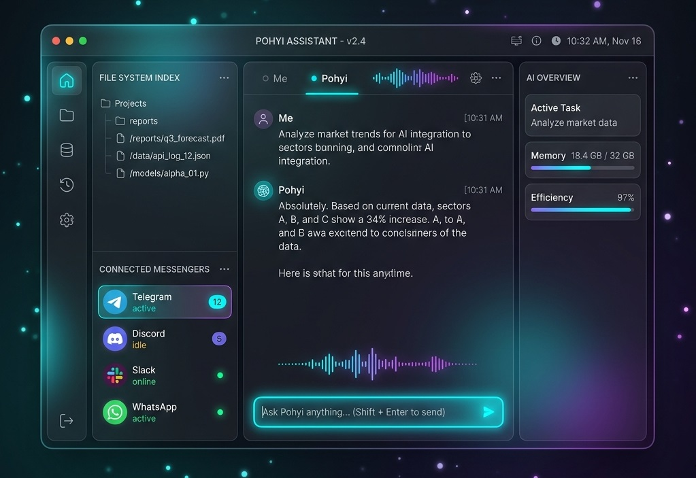
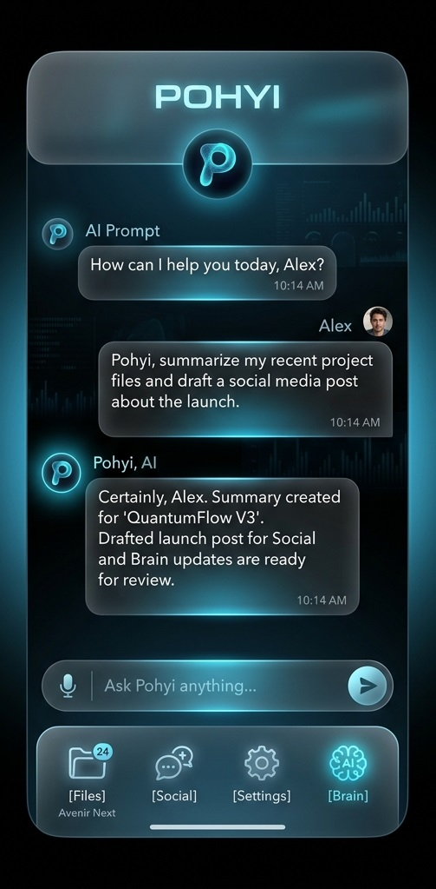

  
# 🧠 P.O.H.Y.I.
**Predictive Optimized Hyper-Yield Intelligence**

*The Cognitive OS Layer for Your Digital Life.*

---

## 🌟 The Vision

Pohyi is not just an assistant—it is a next-generation **Autonomous Cognitive Engine** integrated directly into your operating system. Designed for power users, developers, and executives, Pohyi silently orchestrates your workflows, anticipates your needs, and acts on your behalf with zero friction.

  
   
  <i>Pohyi Core Desktop Environment</i>

 

  
   
  <i>Pohyi Mobile Companion</i>

Imagine a system that never sleeps and never forgets. While you focus on deep architectural work, Pohyi optimizes your local resources, manages communications across dozens of platforms, and proactively researches emerging trends. It bridges the gap between human intent and machine execution.

---

## 🔥 Enterprise-Grade Capabilities

### 📂 Zero-Latency File Indexing
**Absolute digital recall.** Pohyi continuously indexes your entire file system using highly optimized background threads. Whether it's a dataset from years ago or an obscure design sketch, the engine knows its exact location and semantic context.

### 💬 Autonomous Omnichannel Presence
**Your intelligent digital proxy.** Pohyi natively integrates with thousands of REST, GraphQL, and WebSocket APIs. It can maintain context-aware dialogues across platforms like Telegram, Discord, Slack, and WhatsApp, acting as your seamless representative while you are offline.

### 🧠 Omni-Modal Vector Memory
**Recall anything, instantly.** Powered by advanced vector representations, Pohyi tracks cross-platform context. It can instantly retrieve old dialogues, fragmented contacts, and contextual nuances. Even in the event of hardware failure or account loss, your digital memory remains intact.

### 🚀 Proactive Automation & Co-Development
**An active participant in your workflow.** Pohyi analyzes your active environment and proactively writes utility scripts—from custom notification widgets to kernel-level resource optimization—streamlining your daily operations without explicit prompting.

### 🌍 Autonomous Trend Analysis
**Always one step ahead.** Background workers proactively aggregate, parse, and analyze the web for novelties and industry shifts specific to your customized interests, presenting curated intelligence briefings daily.

---

## 💎 Tiers & Architecture

Pohyi is built on a highly scalable, LLM-agnostic architecture, natively supporting both localized edge-computing models and cloud-based intelligence APIs.

### 🟢 Core Tier (Local Edge Mode)
*Optimized for privacy and local execution.*
- **Edge Memory:** Context retention is dynamically constrained by your local hardware limits and database fine-tuning, providing a fast, rolling window of your recent digital history.
- **Local Indexing:** Fast indexing utilizing optimized SQLite instances.
- **Model Agnostic:** Plug-and-play support for local on-premise models ensuring zero data exfiltration.

### 👑 Enterprise / PRO Tier (Hyper-Yield Mode)
*Unleashing distributed cloud infrastructure.*
- **Infinite Omni-Memory:** Backed by highly available, distributed cloud vector databases. Your digital context is stored permanently and securely.
- **Cross-Device Syncing:** Real-time state synchronization. Move from your desktop to your laptop, and the agent's memory and context seamlessly travel with you.
- **Deep Semantic Indexing:** Cloud-accelerated OCR and NLP algorithms instantly process the inside of PDFs, images, and raw data streams.
- **Unlimited Scalability:** Effortless parallel integration with thousands of external APIs and premium Cloud LLM providers.

---

## ⚙️ Core Technology Stack

Pohyi’s foundation is built for extreme performance:
- **High-Performance Core:** The orchestration layer leverages a lightning-fast Go-based event loop, ensuring sub-millisecond startup times and minimal memory footprint.
- **Modular Ecosystem:** Written with a highly extensible Python orchestration layer for rapid plugin development.
- **Universal LLM Integration:** Architected to seamlessly interface with any major AI provider or local model.

## 🚀 Getting Started

*(Installation binaries and enterprise API configuration guides are included in the Beta Release packages).*
